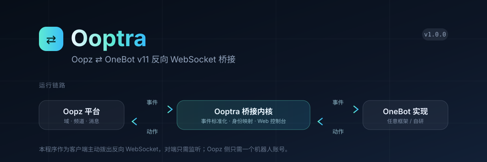
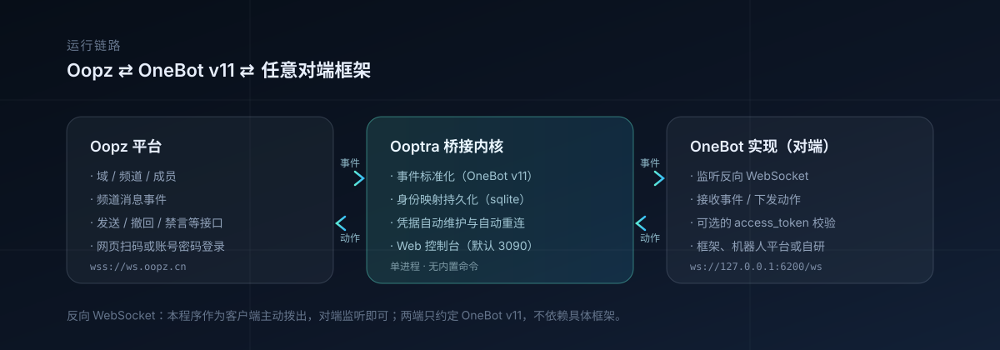

<p align="center">
  
</p>

<p align="center">
  <a href="https://github.com/Eason4869/Ooptra/releases"></a>
  <a href="https://github.com/Eason4869/Ooptra/stargazers"></a>
  <a href="https://github.com/Eason4869/Ooptra/actions/workflows/ci.yml"></a>
  
  <a href="LICENSE"></a>
</p>

<p align="center">
  <a href="#快速开始">快速开始</a> ·
  <a href="#对端对接">对端对接</a> ·
  <a href="#web-控制台">Web 控制台</a> ·
  <a href="#关键配置">关键配置</a> ·
  <a href="#常见问题">常见问题</a> ·
  <a href="CHANGELOG.md">更新日志</a>
</p>

Ooptra 把 Oopz 的频道会话转换为 [OneBot v11](https://github.com/botuniverse/onebot-11) 事件与动作，以
**反向 WebSocket** 接入任意 OneBot v11 实现——机器人框架、平台适配器或自研服务都可以，
两端只约定 OneBot v11 协议，不绑定任何具体框架。项目自带本地 Web 控制台，用来查看状态、跟踪日志、编辑配置和登录 Oopz。

> [!CAUTION]
> Ooptra 是独立的第三方项目，与 Oopz 官方没有隶属或授权关系。请仅用于你自己的账号与你负责管理的社群，
> 并遵守 Oopz 的用户协议与当地法律；软件按“现状”提供，不作任何担保。

## 核心能力

| 场景 | 能力 |
| --- | --- |
| 接入方式 | OneBot v11 反向 WebSocket，本程序作为客户端主动拨出，默认 `universal` 角色，支持 `access_token` |
| 上行事件 | `message`（群 / 私聊）、`notice`（撤回）、`meta_event`（心跳、生命周期） |
| 下行动作 | 发送、撤回、消息查询、群与成员查询、禁言、踢人、退群、设置管理员等 OneBot v11 动作 |
| 身份映射 | `group_id` / `user_id` 与 Oopz 域、频道、成员双向映射，持久化在 SQLite，重启后编号稳定 |
| 凭据维护 | 账号密码或网页版登录；`device_id` / `person_uid` / `jwt_token` / RSA 私钥自动写回配置并自动重连 |
| Web 控制台 | 状态总览、实时日志、配置编辑、账号与凭据管理；前端单文件无外部依赖 |
| 项目边界 | 单进程运行，不含内置命令、插件系统与消息存储，只做桥接与运维 |

## 运行链路

<p align="center">
  
</p>

事件标准化、身份映射、凭据维护与网络适配彼此独立；桥接内核与 Web 控制台在同一个进程内运行。

## 快速开始

需要 Python 3.10 或更高版本。

1. 获取代码并安装依赖：

   ```bash
   git clone https://github.com/Eason4869/Ooptra.git
   cd Ooptra
   python -m venv .venv
   # Windows: .venv\Scripts\activate    Linux / macOS: source .venv/bin/activate
   pip install -r requirements.txt
   ```

2. 生成配置并填入 Oopz 账号：

   ```bash
   # Windows: copy config.example.py config.py    Linux / macOS: cp config.example.py config.py
   ```

   至少要填 `OOPZ_CONFIG["login_phone"]` 与 `OOPZ_CONFIG["login_password"]`，其余凭据字段会在首次登录成功后自动写入。

3. 启动：

   ```bash
   python main.py
   ```

4. 打开 `http://127.0.0.1:3090`，在「配置」页把**反向 WS 地址**改成对端的监听地址（示例默认 `ws://127.0.0.1:6200/ws`），
   保存并重新连接。概览页的「OneBot v11 反向 WS」显示已接入，就说明两端握手成功。

Windows 下可以双击 `start_silent.vbs` 静默后台启动；把它放进「启动」文件夹即可开机自启，
带参数启动（快捷方式目标后加 `delay`）会先等待 30 秒再拉起。

## 对端对接

反向 WebSocket 的方向是**本程序主动拨出、对端监听**。因此对端只需要提供一个 OneBot v11 反向 WS 服务端：

| 项目 | 说明 |
| --- | --- |
| 地址 | `ONEBOT_V11_CONFIG["ws_reverse_url"]`，例如 `ws://127.0.0.1:6200/ws`；路径由对端决定 |
| 令牌 | 对端要求校验时，把相同的值填进 `access_token`；两边都留空则跳过校验 |
| 分离端点 | 对端区分 API / Event 两个端点时，另外填 `ws_reverse_api_url` 与 `ws_reverse_event_url` |
| 连接角色 | 只填 `ws_reverse_url` 时以 `universal` 角色连接，事件与动作走同一条连接 |

如果对端反而是「等待客户端连入」的形态（本地 HTTP 或正向 WebSocket），打开 `enable_http` / `enable_ws`，
再让对端连到 `host:port`（默认 `127.0.0.1:6700`）；纯反向桥接场景不需要打开。

> `data/onebot_v11.sqlite3` 保存 `group_id` / `user_id` 映射，**请勿删除**，否则对端看到的群号与成员编号会全部变化。

## Web 控制台

默认只监听 `127.0.0.1:3090`。访问令牌留空即免登录，仅建议在本机使用时这样做。

| 页面 | 内容 |
| --- | --- |
| 概览 | 两条链路的连接状态、事件与动作吞吐、最近推送与最近指令；异常时直接给出重连入口 |
| 日志 | 实时跟随日志文件（SSE），支持关键字与级别过滤、清屏、下载、回到底部 |
| 配置 | 常用项直接改，其余默认值收在「高级选项」；保存即写回 `config.py` 并就地生效 |
| 账号 | 凭据状态与有效期、账号密码登录、网页版登录（可手动过验证） |

### 绑定到局域网

把 `WEBUI_CONFIG["host"]` 改成 `0.0.0.0` 可以让同网段的设备访问，但**务必同时设置 `token`**，否则任何人都能打开控制台。
设置令牌后访问需带上它：`http://<你的 IP>:3090/?token=<token>`。

## 关键配置

配置文件是 `config.py`，三个分组对应 `OOPZ_CONFIG`、`ONEBOT_V11_CONFIG`、`WEBUI_CONFIG`。
控制台只改写白名单字段，其余内容与注释保持原样。

| 字段 | 说明 |
| --- | --- |
| `OOPZ_CONFIG.login_phone` / `login_password` | Oopz 账号；登录成功后自动写入并维护凭据 |
| `OOPZ_CONFIG.default_area` / `default_channel` | OneBot 调用没有指定目标时的兜底域 / 频道 |
| `OOPZ_CONFIG.proxy` | 网络出口：留空跟随系统代理，`direct` 直连，也可填 `http://主机:端口` |
| `ONEBOT_V11_CONFIG.ws_reverse_url` | 对端的反向 WS 地址，最常修改的一项 |
| `ONEBOT_V11_CONFIG.access_token` | 与对端一致的令牌 |
| `ONEBOT_V11_CONFIG.db_path` | 身份映射数据库路径 |
| `WEBUI_CONFIG.host` / `port` / `token` | 控制台监听地址、端口与访问令牌 |

更细的开关（心跳间隔、重连间隔、本地接入、域语义映射等）都在控制台「配置」页的「高级选项」里，默认值适用于绝大多数情况。

## 环境变量

除 `config.py` 外还支持少量环境变量覆盖，完整清单见 [`.env.example`](.env.example)，常用的有
`BOT_WEBUI_HOST`、`BOT_WEBUI_PORT`、`BOT_WEBUI_TOKEN`、`BOT_ONEBOT_REVERSE_URL`、`BOT_OOPZ_PROXY`。

## 数据文件

| 路径 | 内容 |
| --- | --- |
| `config.py` | 你的配置与凭据，已在 `.gitignore` 中，**请勿提交** |
| `private_key.py` | 登录用的 RSA 私钥，自动生成，同样不入库 |
| `data/onebot_v11.sqlite3` | `group_id` / `user_id` 映射，删除会导致对端群号全部变化 |
| `logs/oopz_bot.log` | 运行日志，控制台「日志」页读取的就是它 |

## 常见问题

- **反向 WS 一直未连接**：确认对端已启动反向 WS 服务端，地址、路径、`access_token` 三者与对端一致；跨机部署还要放行端口。
- **对端收不到消息内容**：Oopz 的频道消息以 `message_type=group` 上报，检查对端是否放行了群消息。
- **群号或成员编号变了**：`data/onebot_v11.sqlite3` 被删除或路径被改动，映射需要重新积累。
- **提示凭据无效**：JWT 过期时程序会尝试用账号密码自动续期；如果当初只导入了 JWT 而没有密码，请在「账号」页重新登录。
- **想让对端连进来**：打开 `enable_http` / `enable_ws`，让对端连到 `127.0.0.1:6700`。

## 使用边界与许可

> [!IMPORTANT]
> 本项目采用 [MIT 许可](LICENSE)，是独立的第三方工具，与 Oopz 官方无隶属关系，也不对 Oopz 服务的可用性作任何保证。

- 请只在自己的账号与有权管理的社群中使用，不要用于骚扰、刷屏或对他人社群做批量自动化。
- `src/oopz_sdk/` 是随项目附带的 Oopz SDK 源码，版权归其原作者所有；如权利人提出异议，我们会移除或替换。
- 项目最初派生自社区项目 `Oopzbot`，当前仓库是围绕「纯 OneBot v11 反向桥接 + Web 控制台」重写后的版本。

## 社区与鸣谢

- [提交问题](https://github.com/Eason4869/Ooptra/issues)
- 协议参考：[OneBot v11](https://github.com/botuniverse/onebot-11)
- 文档组织与产品形态参考了 [SnowLuma](https://github.com/SnowLuma/SnowLuma)（无隶属关系）
