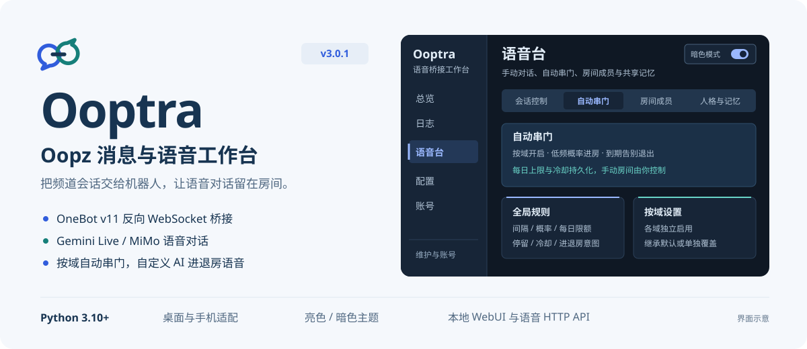
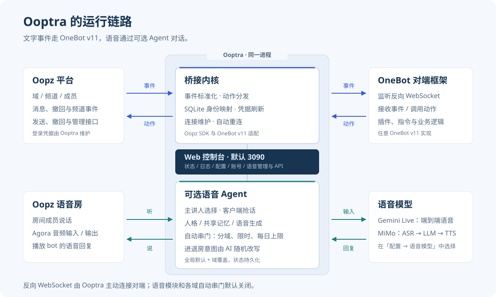

<p align="center">
  
</p>

<p align="center">
  
</p>

<p align="center">
  
</p>

<p align="center">
  <a href="CHANGELOG.md"></a>
  <a href="https://github.com/Eason4869/Ooptra/stargazers"></a>
  <a href="https://hits.sh/github.com/Eason4869/Ooptra/"></a>
  <a href="https://github.com/Eason4869/Ooptra/actions/workflows/ci.yml"></a>
  
  <a href="LICENSE"></a>
</p>

<p align="center">
  <a href="#快速开始">快速开始</a> ·
  <a href="#对端对接">对端对接</a> ·
  <a href="#web-控制台">Web 控制台</a> ·
  <a href="#语音功能">语音功能</a> ·
  <a href="docs/voice-guide.md">语音与 API 指南</a> ·
  <a href="docs/operations.md">配置与维护</a> ·
  <a href="CHANGELOG.md">更新日志</a>
</p>

Ooptra 将 Oopz 消息接入 **OneBot v11**，通过反向 WebSocket 对接机器人框架或自研服务。
自带 Web 控制台，也可开启 AI 语音对话与分域自动串门。

| 功能 | 说明 |
| --- | --- |
| 消息桥接 | 群聊、私聊、撤回、心跳；支持发送消息、成员查询、禁言等 OneBot v11 动作 |
| Web 控制台 | 状态、日志、配置、登录与语音管理；支持手机访问和暗色模式 |
| AI 语音 | Gemini Live / MiMo 级联；支持抢话、回复概率、强制关键词与语音退房 |
| 自动串门 | 按域开启，随机进有人的房间；限时退出、进退房台词、冷却与每日上限 |
| 插件对接 | HTTP API 提供语音控制、人格与记忆管理，支持外部插件调用 |

文字消息指令与插件由对端机器人框架处理。Ooptra 是第三方工具，与 Oopz 官方无隶属关系。

<p align="center">
  
</p>

## 快速开始

需要 **Git、Python 3.10+**。以下命令适用于首次安装；已有配置请先备份，勿覆盖 `config.py`。

### 1. 获取代码

```bash
git clone https://github.com/Eason4869/Ooptra.git
cd Ooptra
python -m venv .venv
```

### 2. 安装依赖并生成配置

Windows PowerShell：

```powershell
.\.venv\Scripts\Activate.ps1
python -m pip install -r requirements.txt
Copy-Item config.example.py config.py
```

Linux / macOS：

```bash
source .venv/bin/activate
python -m pip install -r requirements.txt
cp config.example.py config.py
```

在 `config.py` 中填写 `OOPZ_CONFIG` 的 `login_phone` 和 `login_password`，也可启动后在 WebUI「账号」页登录。
其他登录凭据会自动写入。**语音和网页版登录**还需安装以下可选依赖，纯文字桥接无需安装：

```bash
python -m pip install -r requirements-optional.txt
python -m playwright install chromium
```

### 3. 启动并连接

```bash
python main.py
```

打开 **`http://127.0.0.1:3090`**，在「配置 → 连接」填写对端反向 WS 地址，点击「保存并重新连接」。
概览页显示「OneBot v11 反向 WS」已接入，即连接成功。

Windows 可双击 `start_silent.vbs` 后台启动；开机自启与其他维护说明见[配置与维护](docs/operations.md)。

## 对端对接

Ooptra 主动连接，对端需开启 **OneBot v11 反向 WebSocket 服务端**。

| `ONEBOT_V11_CONFIG` 字段 | 设置 |
| --- | --- |
| `ws_reverse_url` | 对端地址，默认示例 `ws://127.0.0.1:6200/ws`；端口、路径以对端配置为准 |
| `access_token` | 与对端令牌一致；两边留空则不校验 |
| `ws_reverse_api_url` / `ws_reverse_event_url` | 仅对端区分 API / Event 端点时填写；单一地址使用 `universal` 角色 |

也支持本地 HTTP / 正向 WS（默认 `127.0.0.1:6700`），需另外开启 `enable_http` / `enable_ws`。

## Web 控制台

| 页面 | 用途 |
| --- | --- |
| 概览 | 连接状态、事件与动作统计、重连 |
| 日志 | 实时日志、关键词与级别过滤、下载 |
| 配置 | 连接、语音模型、系统设置；不常用项位于「高级选项」 |
| 账号 | 凭据状态、账号密码登录、网页版登录 |
| 语音台 | 会话控制、自动串门、房间成员、人格与记忆 |

右上角可切换暗色模式，选择保存在当前浏览器。侧栏「维护与账号」提供重连、检查更新和退出登录。
**检查更新只查询 GitHub Release / 标签，不会自动下载、安装，也不会检测仅推送到 main 的代码更新。**

局域网访问：将 `WEBUI_CONFIG.host` 设为 `0.0.0.0`，**同时设置 `token`**，然后打开
`http://<部署机器的 IP>:3090/?token=<token>`。默认 `127.0.0.1` 仅允许本机访问。

## 语音功能

语音默认关闭。在「配置 → 语音模型」开启模块，选择后端并填写密钥、模型与音色，
再到「语音台 → 会话控制」选择域和频道进房。支持 **Gemini Live**（语音进出）和 **MiMo 级联**（ASR → LLM → TTS）；OpenAI Realtime 暂不可用。

| 设置 | 行为 |
| --- | --- |
| 语音回复频率 | 默认 **30%**，可设 `0～100%`；按概率接话，手动开口和进退房台词不受限制 |
| 强制回复关键词 | 默认空列表；转写包含关键词即绕过概率，忽略大小写、全半角、空格和标点；同音别名可自行添加 |
| 语音控制退语音 | 默认开启；AI 识别当前监听成员的退房请求，先说离场语再退出；`0%` 回复概率也可触发 |
| 抢话与监听范围 | 默认允许抢话；可调打断门限，或用 `listen_only_uids` 限定监听成员 |
| 人格与记忆 | 在「语音台 → 人格与记忆」管理，记忆保存在本地 |

降低回复频率不保证减少 Gemini 用量；语音退房依赖 ASR / AI 判定，首次启用请实际验证。
后端差异、离场语、手动开口及 API 详见[语音与 API 指南](docs/voice-guide.md)。

### 自动串门

开启语音后，在「语音台 → 自动串门」逐域启用，**所有域默认关闭**。

| 默认策略 | 数值 |
| --- | --- |
| 检查与进房 | 全实例每 **10～20 分钟**检查一次，公平选域后随机选房，进房概率 **20%** |
| 停留 | **10～20 分钟**，到期告别退出；持续空房 **2 分钟**提前静默退出 |
| 自动退房冷却 | 全实例 **30～60 分钟** |
| 手动退房冷却 | 仅刚退出的域 **2～4 小时** |
| 每日上限 | 北京时间自然日，全实例 **3 次**成功自动进房；可另设域上限，`0` 为不限 |

策略采用全局默认与分域覆盖，检查间隔仅支持全局设置。进退房台词可自定义多条，每次随机选取并由 AI 改写。
手动房间由用户控制；暂停、空台词与异常恢复规则见[自动串门说明](docs/voice-guide.md#自动串门)。

## 配置与维护

常用配置可在 WebUI 修改；完整字段见 [config.example.py](config.example.py)，
环境变量见 [.env.example](.env.example)。程序**不会自动读取 `.env`**，需把变量设进进程环境。

升级或迁移前备份 `config.py`、`private_key.py` 和 `data/`，不要提交账号凭据。
**请保留 `data/onebot_v11.sqlite3`**，删除会改变群与成员编号；自动串门状态文件也应保留，以延续额度和冷却。

配置字段、数据文件、Windows 启动与完整排查说明见[配置与维护指南](docs/operations.md)。

## 常见问题

- **反向 WS 未连接**：检查对端服务、地址、路径、令牌；跨机部署还需放行端口。
- **凭据无效**：有账号密码时自动续期；只导入 JWT 时，请到「账号」页重新登录。
- **进房后没有回复**：检查语音开关、可选依赖、API Key、模型代理与会话日志；默认只随机回应约三成发言。
- **语音进退房失败**：核对「会话控制」状态与日志，确认账号实际所在房间后重试；自动串门暂停时先处理原因。

## 开发与测试

```bash
python -m pip install -r requirements-dev.txt
ruff check .
pytest -q
pyright  # 可选：类型检查
```

CI 在 PR 和 `main` / `dev` 推送时执行 Ruff 与 pytest，覆盖 Ubuntu（Python 3.10 / 3.13）和 Windows（Python 3.13）。
源码目录与测试注意事项见[开发说明](docs/operations.md#开发说明)。

## 许可与鸣谢

采用 [MIT 许可](LICENSE)，软件按现状提供。请遵守平台协议与当地法律，仅用于自己的账号及有权管理的社群，勿用于骚扰或刷屏。
项目源自社区项目 `Oopzbot`；内置 `src/oopz_sdk/` 的版权归原作者，如权利人提出异议会移除或替换。

[提交问题](https://github.com/Eason4869/Ooptra/issues) · [OneBot v11 协议](https://github.com/botuniverse/onebot-11) ·
[SnowLuma](https://github.com/SnowLuma/SnowLuma)（文档与产品形态参考，无隶属关系）

访问计数仅作曝光参考，不代表独立访客；维护者可在 [GitHub Traffic](https://github.com/Eason4869/Ooptra/graphs/traffic) 查看近 14 天访问与克隆统计。
